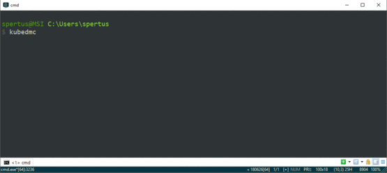

# Kubedmc
One finger kubectl command line :)

Just use arrows to navigate through your essentials objects in your kubernetes cluster.

Requirement : you need at leat **.Net Core 2.1** installed on you machine !   
Download .NET Core 2.1 (or 2.2) : [https://dotnet.microsoft.com/download](https://dotnet.microsoft.com/download)

Install the tool from your favorite command line:
``` cmd
$ dotnet tool install -g kubedmc
You can invoke the tool using the following command: KubeDmc
Tool 'kubedmc' (version '1.0.0') was successfully installed.
```

Then just launch `kubedmc` and then use arrows to navigate :)
```cmd
$ kubedmc     

? Choose a ressource:       
> Get Namespaces            
> Get Nodes                 
> Cluster info              
> Current config            
< Back                      
< Exit                      
```

Quick overview:


